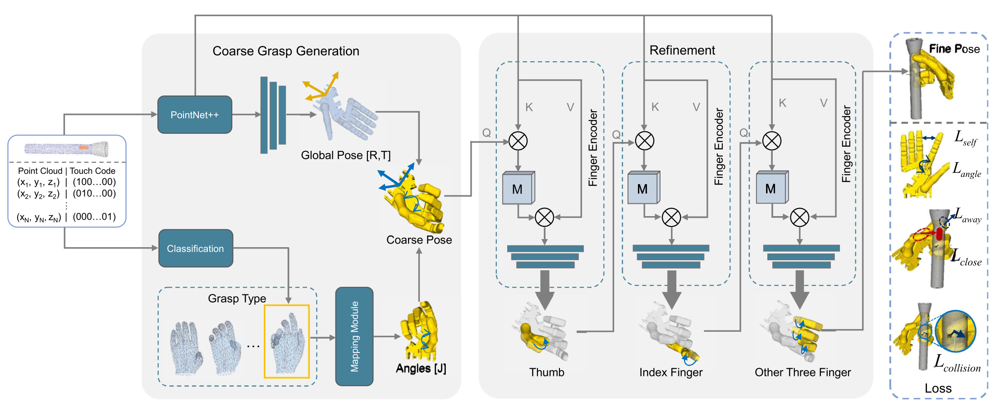

# Functionalgrasp
This is the official code of [FunctionalGrasp_Learning_Functional_Grasp_for_Robots_via_Semantic_Hand-Object_Representation](https://ieeexplore.ieee.org/document/10093013).

## Introduction

  Successful grasp is an important and long-standing issue for robots to interact with the real world. Most recent studies
have devoted more attention to stable grasp rather than functional grasp, which cannot guarantee task-oriented postgrasp manipulation. To achieve human-like functional grasp, a semantic representation of functional hand-object interaction is introduced without labeling 3D hand poses, and a novel coarse-to-fine grasp generation network is designed to model this hand-object interaction. First, a coarse grasp is generated by combining the global hand pose and hand grasp type. Then, the fine pose will be optimized by guiding each finger to focus on the corresponding functional region of the object. Experimental results demonstrate the effectiveness of our method in achieving functional grasps for dexterous hands in the absence of high-DoF grasp poses annotation of the hand.
## Get started
**Common Packages:** 

        we use: (other version will be available)
        conda create -n functionalgrasp python=3.6
        conda activate functionalgrasp
        pip install torch==1.10.1 numpy==1.19.5 

In this project, the grasp synthesis network is based on [KPConv](https://github.com/HuguesTHOMAS/KPConv-PyTorch/blob/master/INSTALL.md), and we use [GraspIt!](http://graspit-simulator.github.io/build/html/installation_linux.html) to view the results. Please configure the development environment according to the instructions in the links.

**Installation process:**
* Download this code and unzip it. Note: 'cpp_wrappers', etc. are from [KPConv].

* [GraspIt!](http://graspit-simulator.github.io/build/html/installation_linux.html): It is recommended to install the ubuntu version.

* [Toward-Human-Like-Grasp](https://github.com/zhutq-github/Toward-Human-Like-Grasp): It is recommended to install the ubuntu version.

* [Pointnet/Pointnet++](https://github.com/yanx27/Pointnet_Pointnet2_pytorch): It is recommended to install the ubuntu 

* If your research continues to be based on the above two projects, please directly cite the original work.

## Two stage 
* First, obtain the grasp type, which code is in **Grasptype_bruch**
* Second, functional grasp synthesis, which code is in **GraspNet**

## Citation
If you find our work useful in your research, please consider citing:
```
@article{zhang2023functionalgrasp,
  title={FunctionalGrasp: Learning Functional Grasp for Robots via Semantic Hand-Object Representation},
  author={Zhang, Yibiao and Hang, Jinglue and Zhu, Tianqiang and Lin, Xiangbo and Wu, Rina and Peng, Wanli and Tian, Dongying and Sun, Yi},
  journal={IEEE Robotics and Automation Letters},
  year={2023},
  publisher={IEEE}
}
```

